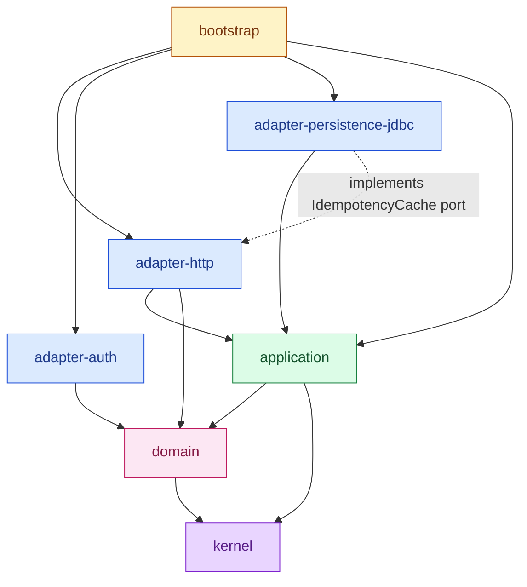

# Architecture

> Four concentric rings. Dependencies point inward. The compiler enforces it.

```
┌──────────────────────────────────────────────────────────┐
│  bootstrap            (composition root, main, wiring)   │
│ ┌──────────────────────────────────────────────────────┐ │
│ │  adapters         (HTTP, JDBC, auth-crypto)          │ │
│ │ ┌──────────────────────────────────────────────────┐ │ │
│ │ │  application  (use cases, UnitOfWork)            │ │ │
│ │ │ ┌──────────────────────────────────────────────┐ │ │ │
│ │ │ │  domain  (aggregates, value objects, errors) │ │ │ │
│ │ │ │ ┌────────────────────────────────────────────┐ │ │ │
│ │ │ │ │  kernel  (Result, Identifier, DomainEvent) │ │ │ │
│ │ │ │ └────────────────────────────────────────────┘ │ │ │
│ │ │ └──────────────────────────────────────────────┘ │ │ │
│ │ └──────────────────────────────────────────────────┘ │ │
│ └──────────────────────────────────────────────────────┘ │
└──────────────────────────────────────────────────────────┘
```

## The five modules

| Module | Owns | May depend on |
| --- | --- | --- |
| `kernel` | Building blocks shared by everything: `Result<T,E>`, `Identifier`, `ValueObject`, `AggregateRoot`, `DomainEvent`, `DomainError` | nothing |
| `domain` | Aggregates, value objects, repository **ports**, sealed domain errors, domain events | `kernel` |
| `application` | Use cases, command/query records, `UnitOfWork` port | `kernel`, `domain` |
| `adapter-*` | Concrete impls: JDBI repos, Helidon routes, Argon2 hasher, JWT issuer | `kernel`, `domain`, `application` |
| `bootstrap` | Composition root — wires everything, exposes `main` | every module |

`adapter-*` modules **do not depend on each other** — composition is bootstrap's job. The one documented exception is `adapter-persistence-jdbc` depending on `adapter-http` to implement the `IdempotencyCache` port. (The port lives where it's used, the impl lives where the storage technology lives.)

### Dependency graph



Solid arrow = compile-time dependency. Dashed arrow = the one documented sibling-adapter coupling (port lives in `adapter-http`, impl in `adapter-persistence-jdbc`).

## Ports & adapters

Every external integration is a Java interface owned by `domain` or `application`, called a **port**. Adapters in `adapter-*` modules implement them.

| Port | Lives in | Implemented by |
| --- | --- | --- |
| `UserRepository` | `domain` | `JdbiUserRepository` |
| `CredentialsRepository` | `domain` | `JdbiCredentialsRepository` |
| `RefreshTokenRepository` | `domain` | `JdbiRefreshTokenRepository` |
| `PasswordHasher` | `domain` | `Argon2PasswordHasher` |
| `TokenIssuer` | `domain` | `JwtTokenIssuer` |
| `RefreshTokenStrategy` | `domain` | `HmacRefreshTokenStrategy` |
| `DomainEventPublisher` | `domain` | `JdbiOutboxDomainEventPublisher` |
| `UnitOfWork` | `application` | `JdbiUnitOfWork` |
| `IdempotencyCache` | `adapter-http` | `JdbiIdempotencyCache` |

**Why this layout?** Three things fall out:

1. **The domain is testable without a database, HTTP server, or any framework.** Fakes for every port live under `application/src/test/`. Use-case tests run as plain JUnit in milliseconds.
2. **Swapping infrastructure is local.** Replace JDBI with R2DBC, or Helidon with Vert.x — only one adapter changes. Domain and application don't.
3. **Architectural drift is a build failure, not a code-review burden.** The rules below are checked by ArchUnit on every CI run.

## The dependency rules (enforced by ArchUnit)

See [`bootstrap/.../architecture/ArchitectureTest.java`](../bootstrap/src/test/java/myfluxo/bootstrap/architecture/ArchitectureTest.java).

| Rule | Reason |
| --- | --- |
| `domain` depends only on `kernel` | Keeps the domain framework-free and pure |
| `application` depends only on `kernel` + `domain` | Use cases must not know about HTTP or SQL |
| `kernel` has no framework imports | Building blocks must be portable |
| `domain` has no framework imports (`io.helidon`, `org.jdbi`, `jakarta.persistence`, Spring, Jackson...) | Same as above |
| `adapter-http` does not depend on `adapter-persistence-jdbc` | Sibling adapters compose via bootstrap, not directly |

Break a rule, get a red CI run with a precise message:

```
Architecture Violation [Priority: MEDIUM]
- Rule: no classes that reside in package 'myfluxo.domain..'
        should depend on classes that reside in 'myfluxo.adapter..'
- Violation: Method <myfluxo.domain.users.User.persist()>
             calls <myfluxo.adapter.persistence.jdbc.JdbiUserRepository.save(...)>
```

## Composition root

`bootstrap/src/main/java/myfluxo/bootstrap/AppFactory.java` is the only place where every module shows up at once. It instantiates concrete adapters, plugs them into the use cases, and starts the HTTP server.

DI is Avaje Inject — compile-time, no reflection. Adding a new singleton is a `@Singleton` annotation; the generator wires it.

## Why this stack

| Concern | Choice | Rationale |
| --- | --- | --- |
| Language | Java 25 LTS | Records, sealed types, pattern matching, scoped values — modern Java is closer to Kotlin/Scala for domain modelling than it has been in 20 years |
| HTTP | Helidon 4 SE (Níma) | Virtual-thread-native server; no Servlet API, no Spring, no reactive callback hell |
| DB access | JDBI 3 | Declarative SQL, no codegen, no bytecode magic, sees the actual schema |
| DI | Avaje Inject | Compile-time, no reflection, error-at-build-time when wiring is wrong |
| Migrations | Flyway 11 | Versioned, checksummed, drift-checked in CI |
| Build | Maven 3.9+ | Stable, well-tooled, fewer surprises than Gradle for a public starter |
| Tests | JUnit 5 + AssertJ + Testcontainers | The real DB in CI; no in-memory simulation |

**No Spring, no Hibernate, no JOOQ codegen.** See the trade-offs called out in the top-level [README](../README.md#why-no-spring--hibernate--jooq-codegen).

## See also

- [`docs/persistence.md`](persistence.md) — how the adapter-persistence-jdbc layer works
- [`docs/result-and-errors.md`](result-and-errors.md) — the Result<T,E> contract every use case returns
- [`docs/schema-drift.md`](schema-drift.md) — the CI gate that catches records-vs-migrations drift
