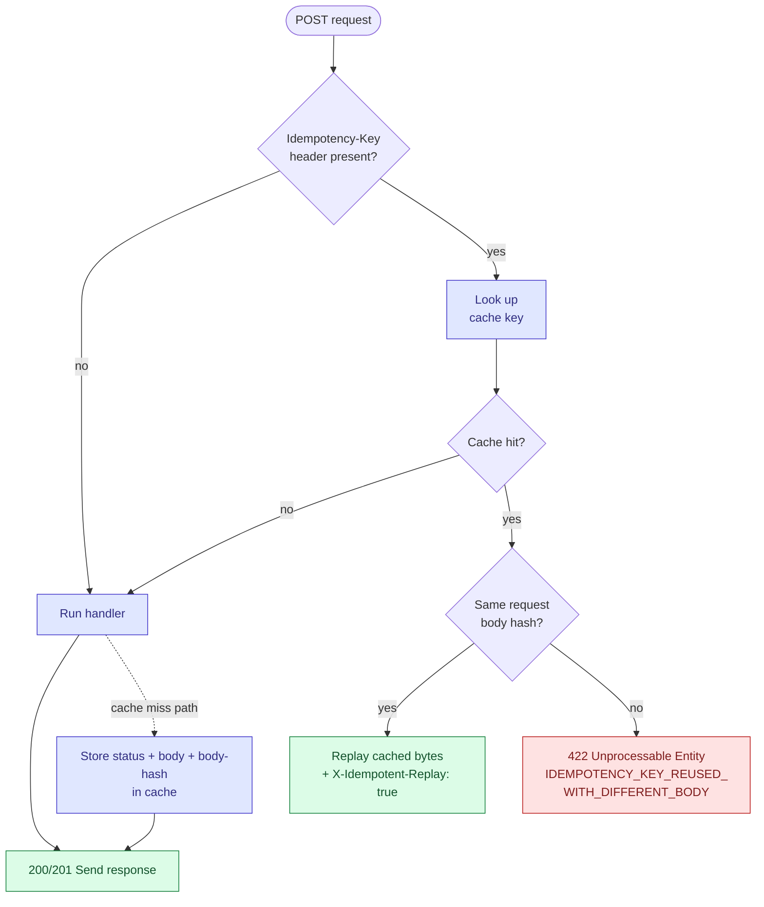

# Idempotency middleware

> Stripe / IETF "Idempotency-Key" header support, wrapped as a one-line middleware. Use cases stay unaware.

`adapter-http/src/main/java/myfluxo/adapter/http/idempotency/IdempotencyMiddleware.java`

---

## The problem it solves

> "I called `POST /charges`. The network blipped. I have no idea if it went through. Should I retry?"

Without idempotency support, the answer is "maybe, depending on where the failure was". Retrying might double-charge. Not retrying might lose the request entirely.

With idempotency support:

```
POST /v1/payments
Idempotency-Key: 7c9e6a98-d5e1-4f8b-...
{
  "amount": 1000,
  "currency": "USD"
}
```

The server **replays the response** on retry if the key has been seen before. Same request body = same response, byte-for-byte. Different request body with the same key = `422 Unprocessable Entity` (client bug).

This is the [IETF draft](https://datatracker.ietf.org/doc/html/draft-ietf-httpapi-idempotency-key-header) and the [Stripe API convention](https://stripe.com/docs/api/idempotent_requests).

---

## The four cases

```java
public void run(ServerRequest req, ServerResponse res,
                Function<byte[], HttpResult> handler) { ... }
```

| Case | What happens |
| --- | --- |
| **No `Idempotency-Key` header** | Run handler, send response. No caching. |
| **Key present, cache miss** | Run handler, **capture** `(status, body)`, **store** under `(key, requestBodyHash)`, send. |
| **Key present, cache hit, same body hash** | **Replay** stored bytes verbatim. Add `X-Idempotent-Replay: true` header. |
| **Key present, cache hit, different body hash** | `422 Unprocessable Entity` — key reuse with a different payload is a client bug. |



---

## Why hash the request body too

A naïve implementation keys the cache on just the `Idempotency-Key`. That's enough for the Stripe contract, but the "different body hash → 422" case adds an important guard:

> Two genuinely different requests with the same key should not silently return the same response.

If a buggy client reuses a key by mistake for a different request, **silently returning the first response is a worse failure than complaining**. The body-hash check makes that loud.

---

## What gets cached

```java
record CachedResponse(
    String requestHash,    // SHA-256(request body) — hex
    int statusCode,
    byte[] body,           // serialized response bytes
    String contentType
) {}
```

The middleware caches the **serialized response bytes**, not a higher-level object. Two reasons:

1. **Replay is byte-identical.** Whatever the client got the first time, they get on retry. No "the second JSON has a different field order" surprises.
2. **The cache doesn't need to know the response type.** It stores opaque bytes; the handler can return anything serializable.

Cache implementation: `IdempotencyCache` port. Default impl `JdbiIdempotencyCache` stores in Postgres. Swappable for Redis or any other store.

---

## Wiring

The middleware is a single `run(req, res, handler)` call. Adapting an existing route:

```java
// Without idempotency:
routes.post("/v1/payments", (req, res) -> {
    var body = req.content().as(byte[].class);
    var cmd = parseCommand(body);
    var result = createPayment.handle(cmd);
    sendResponse(res, result);
});

// With idempotency — wrap the handler closure:
routes.post("/v1/payments", (req, res) -> {
    idempotencyMiddleware.run(req, res, requestBody -> {
        var cmd = parseCommand(requestBody);
        var result = createPayment.handle(cmd);
        return toHttpResult(result);
    });
});
```

The handler returns `HttpResult(int status, Object body)`; the middleware serializes and either caches+sends, or sends and caches, or sends an error.

---

## Use cases stay clean

This is the design payoff. `CreatePayment` doesn't know anything about idempotency:

```java
public Result<PaymentDto, PaymentError> handle(CreatePaymentCommand cmd) {
    return uow.inTransaction(() -> { ... });
}
```

No idempotency-key parameter, no "if I've seen this before" checks, no cache lookups. The middleware sits between HTTP and the use case and handles it transparently.

This also means **idempotency is opt-in per endpoint**. `GET` and naturally-idempotent operations need no middleware. `POST`s that create resources or trigger side effects wrap their handler.

---

## What you don't get out of the box

- **TTL on cached entries.** The default Postgres-backed cache stores rows indefinitely. A real deployment usually wants `(key, expires_at)` with a periodic delete or partial index. One SQL UPDATE away.
- **Idempotency for streaming responses.** The middleware buffers the response body. Don't wrap an endpoint that emits megabytes.
- **Per-tenant key isolation.** The cache is global. If you need "tenant A's `key=abc` is different from tenant B's `key=abc`", the cache key should be `(tenantId, idempotencyKey)`. Trivial change in `IdempotencyCache`.

---

## See also

- [`docs/outbox.md`](outbox.md) — sibling pattern for at-least-once event delivery (which is *why* sinks must be idempotent)
- [`docs/architecture.md`](architecture.md) — the `IdempotencyCache` port crossing-the-adapter-boundary case
