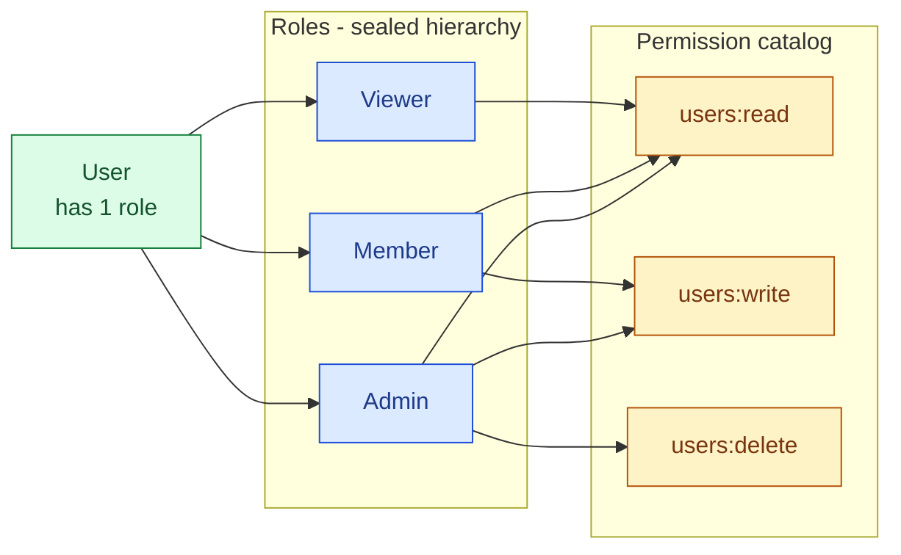

# RBAC — Permission × Role

> Permissions are value objects. Roles are a sealed sum type holding sets of them. Adding a permission is one line; adding a role is a sealed-hierarchy variant.

`domain/src/main/java/myfluxo/domain/auth/model/Permission.java`
`domain/src/main/java/myfluxo/domain/auth/model/Role.java`

---

## The model



The pipeline at the HTTP boundary:

```
access-token claim "role"  →  JwtBearerAuth.requirePermission(req, Permission.USERS_DELETE)
                              ├─ no token / bad token  → 401 Unauthenticated
                              ├─ valid token, role lacks perm → 403 Forbidden
                              └─ valid token, role holds perm → CurrentUser, proceed
```

---

## `Permission`

A `Permission` is the pair `(resource, action)`.

```java
public record Permission(String resource, String action) implements ValueObject {
    public static final Permission USERS_READ   = new Permission("users", "read");
    public static final Permission USERS_WRITE  = new Permission("users", "write");
    public static final Permission USERS_DELETE = new Permission("users", "delete");
    public static final Set<Permission> ALL = Set.of(USERS_READ, USERS_WRITE, USERS_DELETE);
}
```

Wire form: `users:read`, `users:write`, `users:delete`.

### Naming conventions

| Field | Rule | Examples |
| --- | --- | --- |
| `resource` | lowercase plural domain noun | `users`, `products`, `orders` |
| `action` | lowercase verb | `read`, `write`, `delete` |

`read` covers list + get. `write` covers create + update. Add finer verbs only when a role needs the distinction (e.g., `products:publish` separated from `products:write`).

### Adding a permission

```java
public static final Permission PRODUCTS_READ = new Permission("products", "read");
```

Add it to `Permission.ALL`, then grant it to whichever roles should hold it.

---

## `Role`

A sealed interface:

```java
public sealed interface Role permits Role.Admin, Role.Member, Role.Viewer {
    Set<Permission> permissions();
    String name();
    default boolean hasPermission(Permission p) { return permissions().contains(p); }
}

final class Admin  implements Role { ... permissions() = Permission.ALL ... }
final class Member implements Role { ... permissions() = { USERS_READ, USERS_WRITE } ... }
final class Viewer implements Role { ... permissions() = { USERS_READ } ... }
```

### Why sealed, not an open enum/registry

Roles are **deliberately closed at compile time**. Adding a role is a code change, a PR, and a review. It can't be done by an admin via UI.

| Closed (this kit) | Open (DB-driven registry) |
| --- | --- |
| Authorization surface is auditable in source | Surface lives in data, harder to audit |
| `switch` over `Role` is exhaustive — compiler catches "forgot to handle Viewer" | No compiler help |
| Adding a role is friction (PR + review) | Adding a role is one INSERT |
| Roles can't drift between environments | Roles can drift |

For a starter kit, closed is the right default. For a system where roles need self-service definition (e.g., a B2B SaaS where each tenant defines its own roles), replace `Role` with a `record Role(String name, Set<Permission> permissions)` and a `RoleRepository`. The `Permission` model stays the same.

### Adding a role

1. Add a new `final class` to the `Role` sealed hierarchy.
2. Implement `permissions()` and `name()`.
3. Add a case to `Role.fromName` (wire-name deserialization).
4. Compiler catches every `switch` over `Role` that doesn't handle the new variant.

---

## Enforcement at the HTTP boundary

`adapter-http/src/main/java/myfluxo/adapter/http/auth/JwtBearerAuth.java`

Two methods, two failure modes:

```java
// Authentication only — does the caller have any valid token?
Result<CurrentUser, AuthError> require(ServerRequest req);
//   Err: Unauthenticated (no token / bad token)              → 401

// Authentication + permission — does the caller hold this permission?
Result<CurrentUser, AuthError> requirePermission(ServerRequest req, Permission p);
//   Err: Unauthenticated  (no token / bad token)             → 401
//   Err: Forbidden(p)     (valid token, role lacks the perm) → 403
```

Usage in a route:

```java
routes.get("/v1/users/{id}", (req, res) -> {
    var auth = bearerAuth.requirePermission(req, Permission.USERS_READ);
    switch (auth) {
        case Result.Ok<CurrentUser, AuthError>(CurrentUser current) -> {
            // current.userId(), current.role()
            // ... call use case, send response ...
        }
        case Result.Err<CurrentUser, AuthError>(AuthError err) -> {
            switch (err) {
                case AuthError.Unauthenticated __ -> res.status(401).send(...);
                case AuthError.Forbidden(Permission required) ->
                    res.status(403).send("missing permission: " + required.name());
                default -> res.status(500).send();
            }
        }
    }
});
```

### Why enforce at the HTTP boundary and not in the use case

| Boundary enforcement (this kit) | Use-case enforcement |
| --- | --- |
| Use cases stay testable with no `CurrentUser` context plumbing | Every use case needs a `CurrentUser` param |
| One place to read for the auth posture of every endpoint | Auth checks scattered across the codebase |
| Use cases reusable across different auth surfaces (e.g., admin CLI bypasses HTTP RBAC) | Use cases hardcode HTTP auth semantics |

The trade-off: a use case that needs to know "who is the caller" still gets passed the `UserId` from the route. The route knows about authentication; the use case knows about identity. Clean split.

---

## `CurrentUser`

`adapter-http/src/main/java/myfluxo/adapter/http/auth/CurrentUser.java` is the validated, authenticated representation of the caller, derived from the JWT claims:

```java
public record CurrentUser(UserId userId, Role role) {
    public boolean hasPermission(Permission p) { return role.hasPermission(p); }
}
```

It is never trusted from request body or query params — only from a verified JWT.

---

## See also

- [`docs/auth.md`](auth.md) — how access tokens are issued (the source of the `role` claim)
- [`docs/result-and-errors.md`](result-and-errors.md) — `AuthError` variants and HTTP mapping
